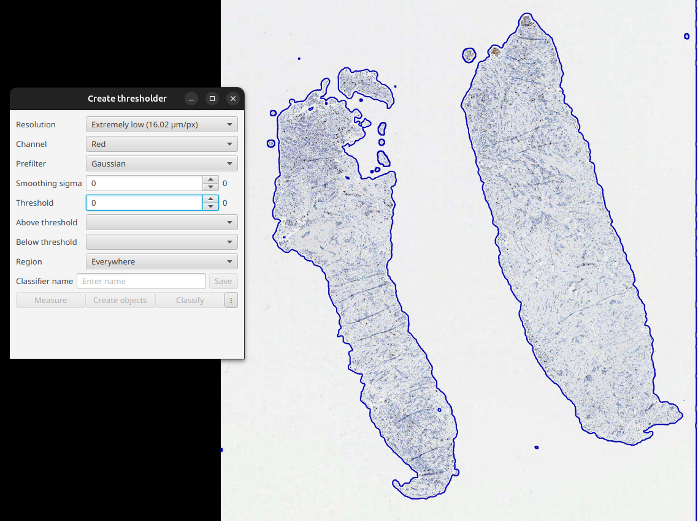

# QuPath Stain Extractor Pipeline

This repository serves as documentation for the steps to follow with QuPath to extract tiles from a `.svs` image (or any other format), ignoring background or less relevant areas.

## Detection :mag_right:

The first step is to create a project in QuPath and add all the images from which you want to extract patches. Choose any one to begin with – which image you pick doesn’t matter.

Once everything is ready, create a pixel-level classifier via:

**Classify** > **Pixel classification** > **Create thresholder**  

A configuration window will appear:




- **Resolution**: Defines the resolution of the image that is thresholded – and thus how ‘blocky’ the output is. This will almost always be lower than the full resolution of the image. In general, choose the lowest resolution that you consider ‘accurate enough’.

- **Channel**: Defines the image channel that will be thresholded. This can also include channels that have been generated computationally, e.g. by color deconvolution, or averaging other channels. Use the Brightness/Contrast pane to visualize how some of these channels look; you want one that gives good contrast for what you want to detect.

- **Prefilter & Smoothing sigma**: Defines how the image is smoothed before thresholding. You probably want to choose ‘Gaussian’ and explore a few sigma values (e.g. 0–5).

- **Threshold**: Defines the threshold; pixels with values above and below can be treated differently. To get an idea of a suitable threshold, move the cursor over the image and check the values shown in the bottom right of the viewer.

- **Above threshold**: Defines the classification of the objects created from pixel values above the threshold. You can leave it blank, or choose ‘Unclassified’ if you don’t want to detect anything above the threshold.

- **Below threshold**: Defines the classification of the objects created from pixel values below the threshold. You can leave it blank, or choose ‘Unclassified’ if you don’t want to detect anything below the threshold.

- **Region**: This doesn’t impact the results; rather, it controls how much of the image QuPath thresholds when you are adjusting settings and previewing the results. Rather than thresholding the whole image (especially if your resolution is high), you can restrict QuPath to threshold only around objects or annotations.

> [!NOTE]  
> Information sourced from the official [QuPath documentation](https://qupath.readthedocs.io/en/stable/docs/tutorials/thresholding.html)


A configuration file is included in the **classifiers** folder, which was used for H&E and Ki67 detection in `.svs` files.

Once the classifier is ready (our detector), save it and use it to create an object from the **full image**. On the next screen, check the **Split objects** option to generate annotations, as shown in the video below.

After saving the classifier, go to the **Workflow** tab and select **Create split**. This generates a script you can reuse across all project images using the selected hyperparameters.

At this stage, all detections for the images are complete.

## Extraction :four_leaf_clover:

For tile extraction, the script **tiles.groovy** is available in the **scripts** folder. It was assembled using code from various forums.

To run the scripts at the project level in QuPath:

```text
Automate > DEPENDS scripts... > Detector
```

In script tab press 3 dots and **Run for project**

```
Automate > DEPENDS scripts... > Tiles
```

Let the program do their thing and check the tiles folder in the project folder.

> [!TIP]
> Line 38 of tiles.groovy is used to extract annotations at the corners. If unnecessary, set this option to false. You may also need a script to filter out valid tiles afterward.

## Bibliography

```cite
@article{bankhead2017qupath,
  title={QuPath: Open source software for digital pathology image analysis},
  author={Bankhead, Peter and Loughrey, Maurice B and Fern{\'a}ndez, Jos{\'e} A and Dombrowski, Yvonne and McArt, Darragh G and Dunne, Philip D and McQuaid, Stephen and Gray, Ronan T and Murray, Liam J and Coleman, Helen G and others},
  journal={Scientific reports},
  volume={7},
  number={1},
  pages={1--7},
  year={2017},
  publisher={Nature Publishing Group}
}
```
## Acknowledgments

Special thanks to [@LauraNicolasSaenz](https://www.youtube.com/@LauraNicolasSaenz) for her amazing YouTube tutorial, which served as a key reference for the detection process:

[](https://www.youtube.com/watch?v=9TmEb3SxS1k)
